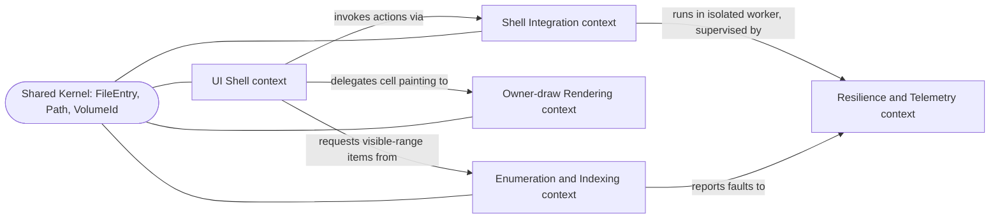

# Context map — Rapid Explorer

```mermaid
flowchart LR
    UI[UI Shell context]
    ENUM[Enumeration and Indexing context]
    RENDER[Owner-draw Rendering context]
    SHELL[Shell Integration context]
    RES[Resilience and Telemetry context]
    SK([Shared Kernel: FileEntry, Path, VolumeId])

    UI -->|requests visible-range items from| ENUM
    UI -->|delegates cell painting to| RENDER
    UI -->|invokes actions via| SHELL
    SHELL -->|runs in isolated worker, supervised by| RES
    ENUM -->|reports faults to| RES

    SK --- UI
    SK --- ENUM
    SK --- RENDER
    SK --- SHELL
```
